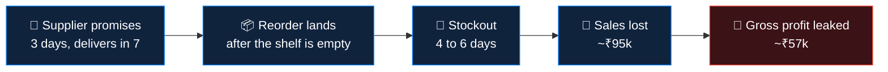
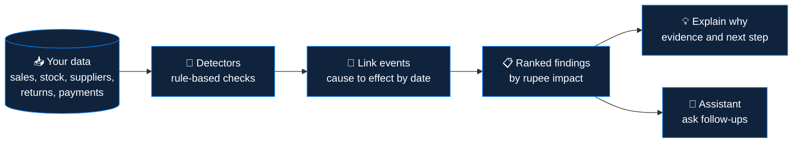
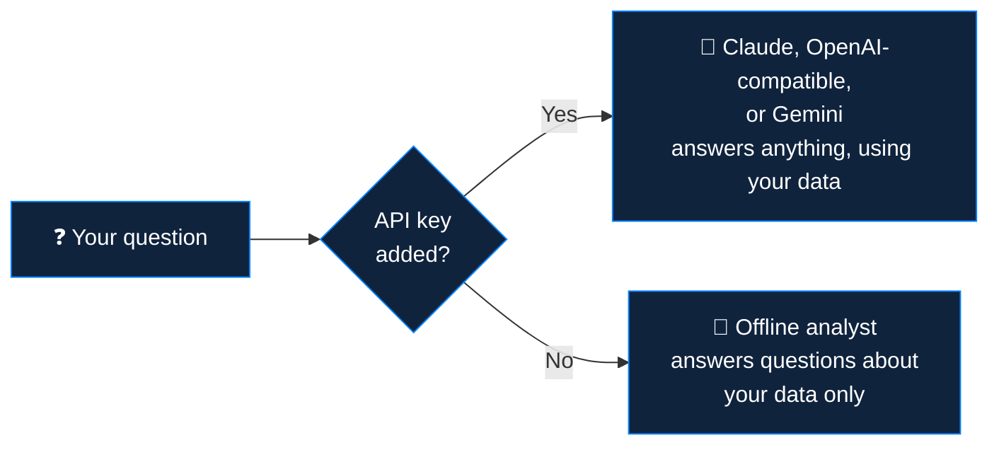
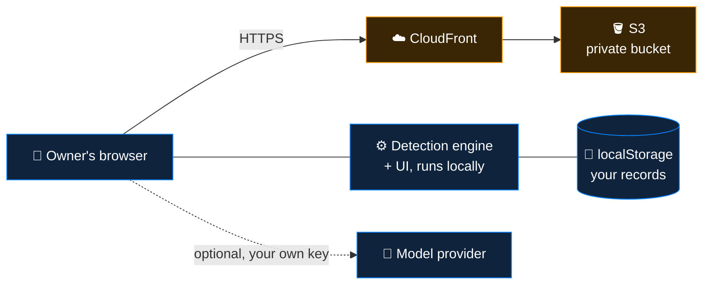
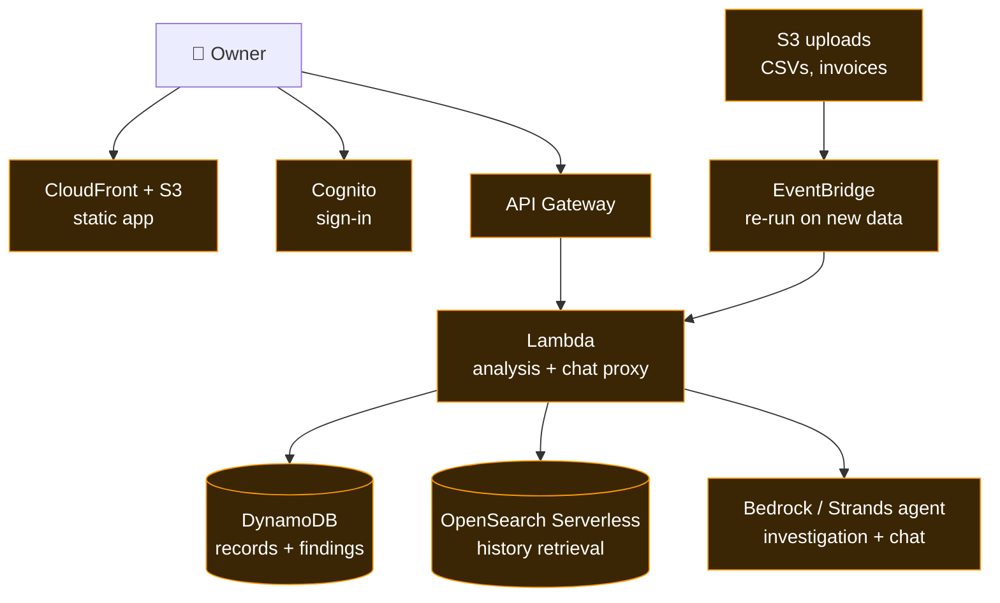
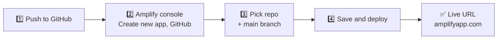

<div align="center">

# 🛡️ Sentinel

### *Find the money your business is quietly losing.*

**Sentinel** reads a small shop's **sales, stock, suppliers, returns & payments** — then tells you  
**what is going wrong, why it is happening, and what to check first.**

<br/>


<br/>


</div>

---

<div align="center">

## ⚡ The Idea in Ten Seconds

*Small shops rarely lose money in one big mistake.*  
*They lose it in dozens of small ones that no chart shows.*

</div>

<table>
<tr>
<th align="center">📊 What the dashboard says</th>
<th align="center">🛡️ What Sentinel finds</th>
</tr>
<tr>
<td>Revenue is steady. Everything looks healthy.</td>
<td>A late supplier emptied your best-selling shelf <b>6 times</b>, costing about <b>₹57k</b> in profit.</td>
</tr>
<tr>
<td>Stock value looks fine.</td>
<td><b>₹1 lakh</b> of cash sits in two products that barely sell.</td>
</tr>
<tr>
<td>Return rate is 2.4%.</td>
<td>One phone-case variant comes back <b>4.7×</b> more than average.</td>
</tr>
<tr>
<td>Payments are "received".</td>
<td>Two customers owe <b>₹1 lakh</b> and habitually pay 15–24 days late.</td>
</tr>
</table>

> 📌 *Figures come from the built-in synthetic demo shop and shift slightly with today's date.*

---

## 🔗 The Core Idea — Link Causes to Effects

Most tools flag **symptoms**. Sentinel connects the **events behind them**, with dates and rupee amounts at every step.



> 💡 Every finding is a **lead to investigate, not a verdict**. Sentinel says so when a chain is based on timing alone.

---

## 🖼️ Tour

<table>
<tr>
<td width="50%" valign="top">
<b>📊 Dashboard</b><br/>
Totals, ranked findings, one-click explanations.<br/><br/>

</td>
<td width="50%" valign="top">
<b>🔍 Explain Why</b><br/>
The reasoning, the evidence and the cause chain.<br/><br/>

</td>
</tr>
<tr>
<td width="50%" valign="top">
<b>📉 Stockout Timeline</b><br/>
Red bands (empty shelf) line up with amber dots (late delivery).<br/><br/>

</td>
<td width="50%" valign="top">
<b>☀️ Light Mode</b><br/>
A professional light theme with the same liquid glass.<br/><br/>

</td>
</tr>
<tr>
<td width="50%" valign="top">
<b>🗂️ Your Own Data</b><br/>
Add, edit, import CSV, export a backup.<br/><br/>

</td>
<td width="50%" valign="top">
<b>💬 Assistant</b><br/>
Ask about your losses, or anything else.<br/><br/>

</td>
</tr>
</table>

<div align="center">
&nbsp;&nbsp;&nbsp;

<br/><sub><i>Fully responsive</i></sub>
</div>

---

## 🔍 What It Catches

| | Finding | What it means | Demo example |
| :---: | --- | --- | --- |
| 🔗 | **Root-cause chain** | A late supplier caused repeated stockouts | ~₹57k lost profit |
| ⏰ | **Stockout risk** | You will run out before the next delivery lands | ~₹6k at risk |
| 📦 | **Dead stock** | Cash locked in products that do not sell | ~₹71k in one keyboard model |
| ↩️ | **Return spike** | One product or variant keeps coming back | 4.7× the shop average |
| 📈 | **Price creep** | Supplier cost rose while your price stayed put | +14% → ~₹12k extra paid |
| 💰 | **Late payers** | Customers who stretch your cash cycle | ₹1 lakh overdue |
| 🚫 | **Stockouts** | Days you could not sell, with no delivery delay to explain them | Shown when present |

---

## 🧭 How It Works



<table>
<tr><th align="center">Step</th><th align="left">What happens</th></tr>
<tr><td align="center"><b>1️⃣</b></td><td><b>Bring your data.</b> Add records by hand or import CSVs.</td></tr>
<tr><td align="center"><b>2️⃣</b></td><td><b>Sentinel investigates.</b> Deterministic detectors scan every table, so each number traces back to a record.</td></tr>
<tr><td align="center"><b>3️⃣</b></td><td><b>It connects the dots.</b> Related events are chained into a likely root cause.</td></tr>
<tr><td align="center"><b>4️⃣</b></td><td><b>You decide.</b> Each finding says what to check first. Nothing changes in your business unless you change it.</td></tr>
</table>

---

## 🚀 Quick Start

> ✅ **Sentinel is a static site.** There is nothing to install or build.

```bash
git clone https://github.com/dhruvareddy20066-commits/Sentinell.git
cd Sentinell
./scripts/serve.sh        # then open http://localhost:8080
```

Or just **double-click** `web/index.html`.

The app opens with a synthetic **electronics shop**.
➡️ Go to **Dashboard** to see the findings.
➡️ Go to **Data** to replace the demo with your own numbers.

---

## 🗂️ Bring Your Own Data

Open **Data** → pick a table → use **Add record** or **Import CSV**.  
The analysis updates the moment you save.

<details>
<summary><b>📄 CSV columns for each table</b> (click to expand)</summary>

<br/>

The first row must be a header. Columns match by key or label, **ignoring case and punctuation**.  
Suppliers and products can be referenced **by name**.  
Dates can be `YYYY-MM-DD` or `DD/MM/YYYY`.

| Table | Columns (required in **bold**) |
| --- | --- |
| **Products** | **name**, category, **cost**, **price**, **stock**, supplier |
| **Suppliers** | **name**, **promisedDays** |
| **Deliveries** | **supplier**, **product**, **qty**, unitCost, **orderedDate**, receivedDate *(empty while in transit)* |
| **Sales** | **date**, **product**, **qty** |
| **Stockouts** | **product**, **start**, **days** |
| **Returns** | **date**, **product**, **qty**, variant, reason |
| **Payments** | **customer**, invoice, **amount**, **dueDate**, paidDate *(empty while unpaid)* |

> 💡 **Tip:** Click **Insert sample rows** in the import dialog to see the exact format for each table.

</details>

**Other data tools:** edit any row by clicking it · undo a delete · export or import a JSON backup · reset to the demo shop · start blank.

---

## 💬 The Assistant

A streaming chatbot that has your **business data as context**.  
Click the **sliders icon** (top right) to connect a model.



| Provider | Default model | Notes |
| --- | --- | --- |
| **Anthropic Claude** | `claude-sonnet-5` | Called from the browser |
| **OpenAI-compatible** | `gpt-4o-mini` | Set the base URL for OpenAI, OpenRouter, Groq, or `http://localhost:11434/v1` for Ollama *(no key needed)* |
| **Google Gemini** | `gemini-2.5-flash` | |

> ✏️ The model name is editable — use any model your account can access.

> [!WARNING]
> **Security.** The key is stored in your browser's `localStorage` and sent only to the provider you pick. That is fine for local use and demos. For a public deployment, **do not ship a key to the browser**. Put a small Lambda function in front of the model and keep the key server-side (see the [roadmap](#-roadmap)).

---

## 📐 The Detection Rules

Everything lives in the `analyze()` function in `web/index.html`. **No black box.**

<details>
<summary><b>📏 Thresholds and formulas</b> (click to expand)</summary>

<br/>

| Finding | Rule |
| --- | --- |
| **Root-cause chain** | A stockout links to a delivery of the same product that arrived **2 or more days late** and landed from 2 days before to 3 days after the stockout ended. Linked stockouts are grouped by supplier. Lost profit = `days out × average daily demand × margin`. |
| **Stockout** | A stockout with no late delivery to explain it. |
| **Stockout risk** | Days of cover (`stock / recent daily demand`) is below the supplier's real typical delivery time. |
| **Dead stock** | More than **90 days** of cover. Cash locked = units above 60 days of demand × unit cost. |
| **Return spike** | 30+ units sold, 5+ returned, and a return rate at least **2×** the shop average and 4 points above it. Cost is estimated at **35%** of unit price per excess return. |
| **Price creep** | 3+ orders with a unit cost, and the latest cost is **8%+** above the first. |
| **Late payers** | Overdue invoices with average lateness of 7+ days, or oldest overdue of 15+ days, or an average of 14+ days across 3+ paid invoices. |
| **Severity** | **High** at `max(₹25,000, 1.2% of revenue)`. **Medium** at `max(₹8,000, 0.4% of revenue)`. |

</details>

---

## ☁️ Architecture

### 🟢 Today (this repo) — a static site, all logic runs in the browser



### 🔵 Next (planned) — move the engine and the model behind serverless AWS services



> 🧩 `web/index.html` keeps the **engine** and the **UI** in two separate script blocks, so the engine can move into a Lambda function unchanged.
> 

---

## 📤 Push to GitHub

From inside the project folder:

```bash
git init -b main
git add .
git commit -m "Sentinel: silent loss detection for small businesses"
git remote add origin https://github.com/dhruvareddy20066-commits/Sentinell.git
git push -u origin main
```

<details>
<summary><b>🛠️ If something goes wrong</b> (click to expand)</summary>

<br/>

| Message | Fix |
| --- | --- |
| `Author identity unknown` | `git config --global user.name "Your Name"` and `git config --global user.email "you@example.com"`, then commit again |
| `remote origin already exists` | `git remote set-url origin https://github.com/dhruvareddy20066-commits/Sentinell.git` |
| `rejected` or `fetch first` | `git pull origin main --allow-unrelated-histories`, then push again |
| Asks for a password | Paste a **personal access token** (GitHub → Settings → Developer settings) |

</details>

---

## 🌍 Deploy to AWS

Pick one — both give you a public HTTPS URL.

| | **🅰️ Amplify Hosting** | **🅱️ S3 + CloudFront** |
| --- | --- | --- |
| **Effort** | ~5 minutes, no CLI | ~10 minutes, needs the AWS CLI |
| **Best for** | Getting a live URL fast | Showing the architecture (private bucket, CDN, IaC) |
| **Redeploys** | Automatically on every push | Run `./scripts/deploy.sh` again |

### 🅰️ Option A — AWS Amplify Hosting



1. **Push the repo to GitHub** *(above).*
2. In the AWS console open **AWS Amplify** → **Create new app** → **GitHub** → authorise access.
3. Select the `Sentinell` repository and the `main` branch. Amplify reads `amplify.yml` and serves the `web/` folder.
4. Click **Save and deploy**. Every push to `main` redeploys automatically.

### 🅱️ Option B — S3 + CloudFront

Creates a **private** S3 bucket served through CloudFront over HTTPS with Origin Access Control.

```bash
aws configure                              # once: paste your access key, region ap-south-1
./scripts/deploy.sh                        # stack "sentinel" in ap-south-1 (Mumbai)
./scripts/deploy.sh my-stack us-east-1     # custom stack name and region
```

The script deploys `infra/template.yaml`, uploads `web/`, clears the CloudFront cache and prints your live URL.  
Run it again after any change. *The first rollout can take a few minutes.*

<details>
<summary><b>🤖 Optional: auto-deploy on every push with GitHub Actions</b> (click to expand)</summary>

<br/>

`.github/workflows/deploy.yml` runs `scripts/deploy.sh` on pushes to `main`, using **OIDC** so no long-lived AWS keys live in GitHub.

1. In AWS IAM, create an OIDC identity provider for `token.actions.githubusercontent.com` and a role GitHub Actions can assume, scoped to your repo.
2. Give the role permissions for **CloudFormation**, **S3** and **CloudFront**.
3. In GitHub, add the repository secret `AWS_ROLE_ARN` *(and optionally the variable `AWS_REGION`)*.

> 💡 *Using Amplify? Delete this workflow.*

</details>

---

> 🧹 **To remove everything (Option B):** empty the bucket, then run  
> `aws cloudformation delete-stack --stack-name sentinel`

> 💰 **Cost:** static hosting on S3 and CloudFront costs a few cents a month at demo traffic and is covered by the AWS Free Tier at low volume. The assistant is billed by whichever model provider you connect.

---

## 🗺️ Roadmap

| Step | What | AWS service |
| :---: | --- | --- |
| **1** | Chat proxy so no API key reaches the browser | Lambda + Bedrock |
| **2** | Move `analyze()` server-side and store records | Lambda + DynamoDB |
| **3** | Upload CSVs and invoices, re-run analysis on arrival | S3 + EventBridge |
| **4** | Sign-in and per-shop access | Cognito |
| **5** | An agent that calls the detectors as tools | Strands agent on Bedrock |

---

## 📁 Project Structure

```text
Sentinell/
├── web/
│   └── index.html            the whole app (HTML, CSS and JS, one file)
├── docs/
│   └── screenshots/          images used in this README
├── infra/
│   └── template.yaml         CloudFormation: private S3 bucket + CloudFront
├── scripts/
│   ├── serve.sh              local dev server
│   └── deploy.sh             one-command deploy to S3 + CloudFront
├── .github/workflows/
│   └── deploy.yml            optional GitHub Actions deploy
├── amplify.yml               Amplify Hosting build settings
├── LICENSE
└── README.md
```

---

## 🧰 Tech Stack

| Layer | Choice |
| --- | --- |
| **App** | Vanilla HTML, CSS and JavaScript — no framework, no dependencies, no build step |
| **Design** | Liquid-glass UI with `backdrop-filter`, View Transitions API for the theme reveal, `IntersectionObserver` reveals, SVG charts, `prefers-reduced-motion` respected |
| **Storage** | Browser `localStorage` with JSON export and import |
| **AI** | Streaming (SSE) to Claude, OpenAI-compatible APIs and Gemini |
| **Hosting** | AWS Amplify Hosting, or S3 + CloudFront via CloudFormation |

---

## ⚠️ Limitations

- 💾 Data lives in the browser's `localStorage` on one device. Use **Export** for backups.
- 🧪 The demo data is **synthetic** and regenerated relative to today's date when you reset it.
- 📐 Findings are **estimates**. Lost profit uses average daily demand on in-stock days, and return cost uses a fixed 35% assumption.
- 🌐 Some model providers block direct browser calls (CORS). If the assistant shows a network error, use a provider that allows it or a backend proxy.

---

## 🎬 Suggested 3-Minute Demo

| Time | Show | Say |
| :---: | --- | --- |
| **0:00** | Home, toggle **Your dashboard** → **Sentinel** | *"Shops lose money in many small ways the dashboard never shows."* |
| **0:20** | Dashboard, totals counting up | *"Seven silent problems, worth roughly ₹2.8 lakh."* |
| **1:00** | Open the **Apex Distributors** finding, then the stockout timeline | *"Every red band lines up with an amber late delivery."* |
| **2:00** | **Data** tab, add a record | *"Add your own numbers and the analysis updates instantly."* |
| **2:30** | **Assistant:** *"What should I fix first?"* | *"It answers from the shop's data, and anything else."* |
| **2:50** | Architecture tab | *"Static today, serverless on AWS next."* |

---

<div align="center">

### 🛡️ Sentinel

**Built with care by Team NxtOps**  
for the **Bharat Builds Tour** hackathon *(WeMakeDevs × AWS)*

Released under the [MIT License](LICENSE)

<br/>


</div>

